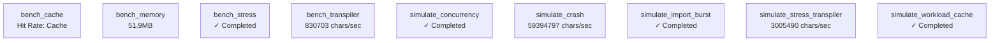

# Φ Engine Performance Report

## Summary

```mermaid
flowchart LR
    A[Φ Engine Benchmarks] --> B["9/9 Passed"]
    B --> C[Performance Validated]

    style A fill:#e1f5fe
    style B fill:#c8e6c9
    style C fill:#dcedc8
```

## Detailed Performance

```mermaid
graph TD
    bench_cache["bench_cache<br/>Hit Rate: Cache"]
    bench_memory["bench_memory<br/>51.9MB"]
    bench_stress["bench_stress<br/>✓ Completed"]
    bench_transpiler["bench_transpiler<br/>830703 chars/sec"]
    simulate_concurrency["simulate_concurrency<br/>✓ Completed"]
    simulate_crash["simulate_crash<br/>59394797 chars/sec"]
    simulate_import_burst["simulate_import_burst<br/>✓ Completed"]
    simulate_stress_transpiler["simulate_stress_transpiler<br/>3005490 chars/sec"]
    simulate_workload_cache["simulate_workload_cache<br/>✓ Completed"]
```

## Results Data
9 benchmarks executed
