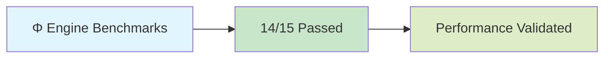

# Φ Engine Performance Report

## Summary

```mermaid
flowchart LR
    A[Φ Engine Benchmarks] --> B["14/15 Passed"]
    B --> C[Performance Validated]

    style A fill:#e1f5fe
    style B fill:#c8e6c9
    style C fill:#dcedc8
```

## Detailed Performance

```mermaid
graph TD
    bench_cache["bench_cache<br/>Hit Rate: Cache"]
    bench_extreme_stress["bench_extreme_stress<br/>5,210,037 chars/sec"]
    bench_memory["bench_memory<br/>49.5MB"]
    bench_stress["bench_stress<br/>✓ Completed"]
    bench_symbol_density["bench_symbol_density<br/>170,079,814 chars/sec"]
    bench_transpiler["bench_transpiler<br/>937032 chars/sec"]
    bench_transpiler_patterns["bench_transpiler_patterns<br/>129,262 chars/sec"]
    bench_transpiler_scaling["bench_transpiler_scaling<br/>2,060,409 chars/sec"]
    simulate_concurrency["simulate_concurrency<br/>✓ Completed"]
    simulate_crash["simulate_crash<br/>51933026 chars/sec"]
    simulate_import_burst["simulate_import_burst<br/>✓ Completed"]
    simulate_phimmuno_threat["simulate_phimmuno_threat<br/>✓ Completed"]
    simulate_stress_transpiler["simulate_stress_transpiler<br/>752845 chars/sec"]
    simulate_workload_cache["simulate_workload_cache<br/>✓ Completed"]
```

## Results Data
15 benchmarks executed
