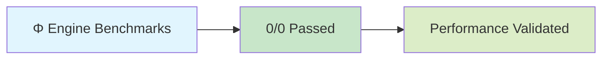

# Φ Engine Performance Report

## Summary

```mermaid
flowchart LR
    A[Φ Engine Benchmarks] --> B["0/0 Passed"]
    B --> C[Performance Validated]

    style A fill:#e1f5fe
    style B fill:#c8e6c9
    style C fill:#dcedc8
```

## Detailed Performance
```mermaid
graph TD
```

## Results Data
0 benchmarks executed
